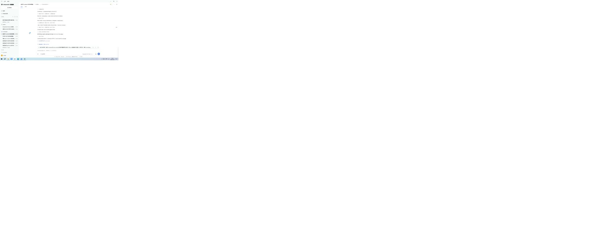

# dsh-screen-recorder

DSH 插件：**录屏，然后把录屏读成结构化语义**。

两件事，各自独立可用：

1. **基础录屏** —— 定长录桌面 / 某个窗口 / 一块矩形，可选同时录一路 DirectShow 声音；录完**解码整个文件数帧**再报告，而不是看进程退出码。
2. **结构化语义** —— 一次解码切出时间轴，每段抽一张关键帧，再对关键帧做 **OCR 文字**、**区域语义分割**、**YOLO 目标检测**，对音轨做**语音转文字**，最后融成一份带证据的 JSON：`structure.json` + 关键帧 + 联系表 + 交付视频 + 章节文件。

插件只做两件事：**执行**与**测量**。一段录屏"重不重要"、分段"切得好不好"、结构"读起来对不对"——都不是它说了算。



> 上图是 `screen_analyze {action:"analyze"}` 在一段真实 6 秒桌面录制上产出的联系表（5×4 拼图，只有一段所以其余是留白）。

## 工具

| 工具 | 作用 | actions |
| --- | --- | --- |
| `screen_env` | 这台机器作为录制目标与阅读目标的事实 | `probe` / `devices` / `components` |
| `screen_setup` | 装 ffmpeg、装或删 YOLO 权重 | `install_ffmpeg` / `install_detector` / `remove_detector` |
| `screen_record` | 定长录制，录完测量 | `screen` / `microphone` |
| `screen_analyze` | 结构化语义，以及它的四个零件 | `analyze` / `scenes` / `regions` / `detect` / `transcribe` |
| `screen_guide` | 完整说明书（按需读，不占每轮的 token） | `overview` / `playbook` / `rules` / `tool` / `action` |

## 快速开始

```text
screen_env      {action:"probe"}                                   # 这台机器能录吗，各个识别组件装了吗
screen_record   {action:"screen", out:"demo.mp4", seconds:20}       # 录 20 秒桌面
screen_analyze  {action:"scenes", input:"demo.mp4"}                 # 先只看时间轴（几秒）
screen_analyze  {action:"analyze", input:"demo.mp4"}                # 完整跑一遍
```

要声音就同时录麦（设备名从 `screen_env {action:"devices"}` 原样抄）：

```text
screen_record {action:"screen", out:"demo.mp4", seconds:20, audioDevice:"麦克风 (Elink-Audio-Driver)"}
```

第一次用某个识别组件之前：

```text
screen_setup {action:"install_detector"}    # 12.8 MB，sha256 校验；顺带把共享推理运行时补上
```

## 结构长什么样

`screen_analyze {action:"analyze", input:"demo.mp4"}` 返回（并写盘）的是一份可以直接检索、diff、喂给下一步的文档：

```jsonc
{
  "plugin": "dsh-screen-recorder",
  "structureVersion": 1,
  "input": { "durationSec": 20, "width": 1760, "height": 894, "fps": 15, "hasAudio": true, "problems": [] },

  "summary": {                       // 先看这一节：段数、每类的段号、文字行数、物体类数、语音段数
    "segmentCount": 5,
    "kinds": { "terminal": [1, 2], "text": [3], "presenter": [4], "desktop": [5] },
    "textLines": 137, "objects": 1, "speechIntervals": 4
  },

  "timeline": {
    "analysisFps": 4, "framesAnalysed": 79,
    "segments": [{
      "id": "s001", "index": 1, "start": 0, "end": 6.25, "seconds": 6.25,
      "reason": "start",             // start / scene_change / motion / cadence
      "sceneScore": 0, "motion": 0.0014,
      "keyframe": "…/keyframes/s001.jpg", "keyframeAt": 3.125,

      "kind": "terminal", "kindLabel": "终端 / 命令行",
      "kindReason": "4 处像命令行输出，且画面 42.1% 是暗色（文字 17.2%、图像 8.4%、暗色 42.1%）。",
      "kindEvidence": { "appearance": {…}, "text": {"shellHits":4,…}, "objects": {"count":0,…}, "motion": 0.0014 },

      "appearances": { "text": 0.172, "picture": 0.084, "texture": 0.049, "flat": 0.696, "dark": 0 },
      "text": "PS C:\\Users\\me> npm run build\n…",
      "textLines": [{ "text": "…", "confidence": null, "box": {"x":13,"y":9,"width":86,"height":11}, "center": {"x":56,"y":15} }],
      "objects": [{ "classId": 0, "label": "person", "score": 0.88, "box": {"x":477,"y":225,"width":83,"height":296}, "center": {"x":518,"y":373} }],
      "speech": { "text": "这一版把录屏的测量补上了", "overlapSeconds": 4.1 }
    }]
  },

  "text":     { "available": true, "engine": "rapidocr:…", "lines": [ /* 每行都带 segmentId 与 at */ ], "keywords": [{"term":"npm","count":4}] },
  "regions":  { "engine": "grid-appearance", "tileSize": 16, "shares": {…}, "frames": [ /* 每段的占比 */ ] },
  "objects":  { "available": true, "model": {"name":"yolov8n","classes":80}, "counts": {"person":3}, "frames": [ /* 每段的框 */ ] },
  "speech":   { "available": true, "provider": "host:speechToText", "intervals": [{ "id":"a001", "start":1.2, "end":4.8, "text":"…" }] },

  "artifacts": { "structure": "…json", "keyframes": "…/keyframes", "contactSheet": "…jpg", "delivery": "…mp4", "chapters": "…txt" },
  "warnings": [],
  "elapsedMs": 2730
}
```

四条规则贯穿整份文档：

- **每个判断都带证据。** `kind` 旁边就是产生它的占比、行数与置信度；一个框旁边就是它的分数。
- **缺什么就说什么。** 没装识别引擎、没装模型、没有音频轨、宿主没有语音服务——一律 `null` + `reason`，并进 `warnings`。一份静悄悄少了一半的结构，和一个"什么都没发生"的录屏，读起来是一样的，那是最坏的失败。
- **坐标永远是源视频像素**，原点左上角，整数。模型读图缩过、YOLO letterbox 补过边，全部在插件内部折回去了。
- **一次解码只回答一个问题。** 时间轴解码一遍；关键帧从那次结果里抽出来，交给 OCR、区域分割与目标检测**按路径**复用——同一秒不会被解码三次。

## 可选组件与共享目录

四个阅读组件互相独立，任一缺席都不影响其余部分；每个都在结果里写明自己是哪一条路走通的：

| 组件 | 谁提供 | 怎么装 | 缺席时的行为 |
| --- | --- | --- | --- |
| ffmpeg | 全家族共用一份 | `screen_setup {action:"install_ffmpeg"}` | 什么都做不了，`screen_env {action:"probe"}` 直接说明 |
| OCR 引擎 | 同级 `dsh-ocr` 的离线引擎优先，否则 Windows 自带识别 | 引擎由 `dsh-ocr` 自己装 | 退回 Windows OCR（大字没问题，小字混排容易读错），`text.engine` 写明用的是哪个 |
| YOLO 权重 | 本插件安装 | `screen_setup {action:"install_detector"}` | `detect` 明确失败并给出安装提示；`analyze` 里 `objects.available=false` + 原因 |
| 推理运行时 | `dsh-video-audio`（抠像、音频事件检测共用） | `audio_setup {action:"install"}`；本插件也会尝试从同级检出的 `vendor/audio` 复制一份，不重复下载 | 同上，`objects.reason` 里点名去哪个插件装 |
| 语音转文字 | 宿主（DSH）的 `speechToText` 服务，本地 SenseVoice | 启用 `@deepseek-ai/dsh-experimental-voice-input-bundle` 后重启 | `speech.available=false` + 要启用哪个 bundle |

共享资产目录（`DSH_PLUGIN_HOME` 可整体换盘）：

```
~/.dsh-plugins/
  ffmpeg/bin/            ffmpeg.exe / ffprobe.exe（全家族共用，约 200 MB）
  models/yolo/           yolov8n.onnx + SOURCE.json（本插件装，12.8 MB）
  ocr/<来源>/            离线 OCR 引擎（dsh-ocr 装）
  lib/onnxruntime-web/   ONNX WASM 运行时（dsh-video-audio 装，13 MB，三个模型共用）
```

**代理**：`fetch` 在 Windows 上不读系统代理设置（浏览器和 PowerShell 会读），所以本插件的下载器在 `fetch` 失败后会自动改用 `curl.exe` + 从注册表读到的系统代理重试一次，并在结果里说明走的是哪条路。两条都不通时，用 `archive` 参数传一个本地文件——**本地文件同样要过 sha256 校验**。

## 设计原则

- **只执行与测量，不判断。** 没有"这段很重要"、没有"这个分段很合理"、没有"识别得不错"。
- **同输入必得同输出。** 时间轴、区域分割、OCR、YOLO、语音切分全部确定性；唯一例外是浮点累加顺序，因此推理默认单线程。
- **录制必须给秒数**，一次最多 3600 秒，且录完一定解码数帧：`ok:true` 才代表真的录到了要求的长度。
- **失败要能执行。** 每条错误都写清：拒绝了什么、期望什么、下一步用哪个工具。

## 已知限制

- **仅 Windows。** 采集走 `gdigrab` / `dshow`，没有这两条路径的实现。
- **Windows 自带 OCR 对小字号中英混排会读错**（`text.engine` 会写 `windows-ocr:*`）。装 `dsh-ocr` 的离线引擎后自动优先使用它；默认语言 `ch`，中英混排的终端建议按内容换 `config.ocr.language`。
- **YOLO 每帧约 0.7–1.5 秒**（单线程 WASM）。所以 `analyze` 只对 `detectMaxFrames`（默认 40）张关键帧做检测，并**跨整段均匀采样**，不是从头取。
- **语音转文字没有逐词时间戳**（宿主只返回整段文本），因此时间对齐的单位是"检测到的停顿之间的语音段"，不是词。
- **一次录制上限 1 小时**；更长的素材请分段录，或用 `startSec`/`durationSec` 分段分析。
- **场景切分靠帧差**：`sceneThreshold` 是 0–255 的平均亮度差，整屏切换通常 40 以上，画面里的小范围变化可能只有 1–2。它不是"内容变了"的检测器。

## 开发与测试

```sh
node --test "tests/*.test.mjs"     # 71 个测试：纯函数 + 插件注册，不需要 ffmpeg、不联网
node scripts/verify-e2e.mjs        # 端到端：真录 6 秒桌面 → 完整结构化（需要 ffmpeg 与一台能录的机器）
```

测试覆盖的是"没人注意就会一直错"的那部分：切分算术、区域阈值、YOLO 两种张量布局与 letterbox 折回、向量相似度与 NMS、语音切分与合并、ffmpeg 列表解析、注册表与 schema 的一致性。

## 许可

插件本体 **MIT**。它按需下载、但**不再分发**两样东西：一份 ffmpeg 构建（GPL），一份 YOLOv8n ONNX 权重（上游 Ultralytics 为 **AGPL-3.0**，来源与摘要记在 `~/.dsh-plugins/models/yolo/SOURCE.json`）。OCR 引擎的许可是 `dsh-ocr` 的事。
